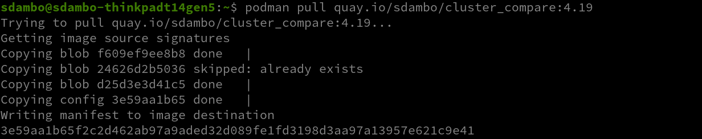
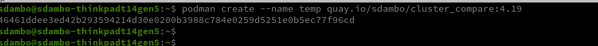
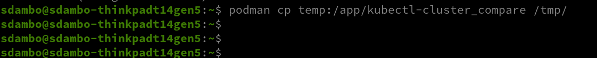
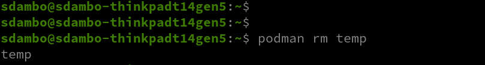
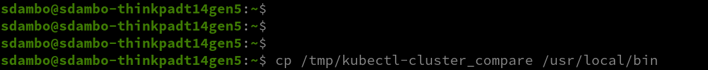
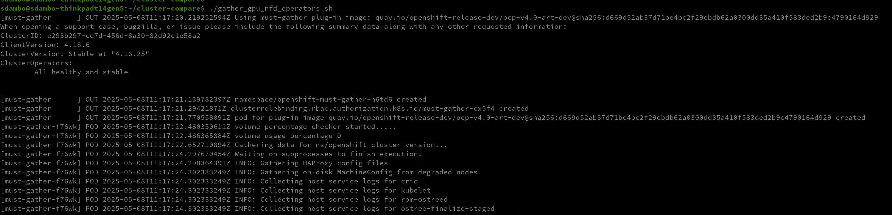
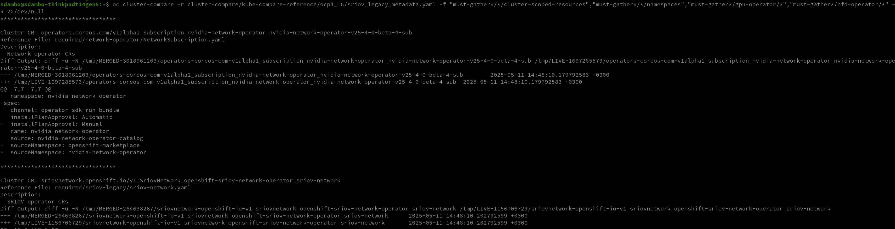

# cluster-compare Install & Usage
## cluster-compare oc plugin installation

**Option 1**

You can use the 4.19 version from available in my repository it was compiled from source code , the reason of compiling the 4.19 is because it has some template creation improvments
pay attention that the file is compiled on rhel9 OS !

And the 4.19 version of the tool isn't released yet...  It's part of 4.19 OpenShift GA :

https://github.com/openshift/kube-compare/blob/release-4.19/docs/image-build.md

you need to clone the cluster compare from github and run it as instructed. and compile it by running:

https://github.com/openshift/kube-compare/tree/release-4.19

```
make cross-build
```

if you want to use the file here copy it to a directory that exists in your search path ,first download it to your home direcory, for example:

```bash
cd ~
sudo cp kubectl-cluster_compare /usr/local/bin
```

**Option 2**

copy kubectl-cluster_compare from image file, Which is located in my quay.io repository:

```bash
podman pull quay.io/sdambo/cluster_compare:4.19
```



Create a temporary Container:

```bash
podman create --name temp quay.io/sdambo/cluster_compare:4.19
```



Copy the binary out:



Remove the temporary container:



Copy the kubectl-cluster_compare binary file to /usr/local/bin ( It is in your search PATH ):



## Using cluster-compare directly on the cluster

clone the cluster compare templates and references to a local directory on your notebook, example:

```bash
git clone https://github.com/sdambo-git/cluster-compare.git
```
In my case I cloned the repository to my home directory,change directory to kube-compare-reference directory please take a look at the image:


You will see there 3 directories named per ocp version:
- ocp4_15
- ocp4_16
- ocp4_17

Change to the directory relevant to the cluster version you are using , I will use for the example version ocp4_16 , and then the oc cluster-compare using the correct reference file againt our running cluster:


From the Image above , You can see that we have currently 3 reference files ( *_metadata.yaml files), distinct by the cluster connection type:
- sriov_legacy_metadata.yaml
- rdma_shared_metadata.yaml
- host_dev_net_metadata.yaml
- gpu_operator_metadata.yaml  (for GPU only configuration ) 🔴

```bash
cd ~/cluster-compare/kube-compare-reference/ocp4_16
oc cluster-compare -r sriov_legacy_metadata.yaml
```

In the following image you will see the command and it`s outcome:


## Using cluster-compare with must-gather

Because must-gather does`t know how to work with some operators ,I created a shell script that need to be run with must gather.

🔴 <span style="color:red"> **! please run the script from the your root home direcoty !**: </span>
- gather_gpu_nfd_operators.sh

It will create 2 output directories:
- must-gather
- must-gather-data



Now we need to run cluster-compare tool against the output folders the must-gather created:

```bash
cd ~
oc cluster-compare -r cluster-compare/kube-compare-reference/ocp4_16/sriov_legacy_metadata.yaml -f "must-gather*/*/cluster-scoped-resources","must-gather*/*/namespaces","must-gather*/gpu-operator/*","must-gather*/nfd-operator/*" -R 2>/dev/null
```
  


